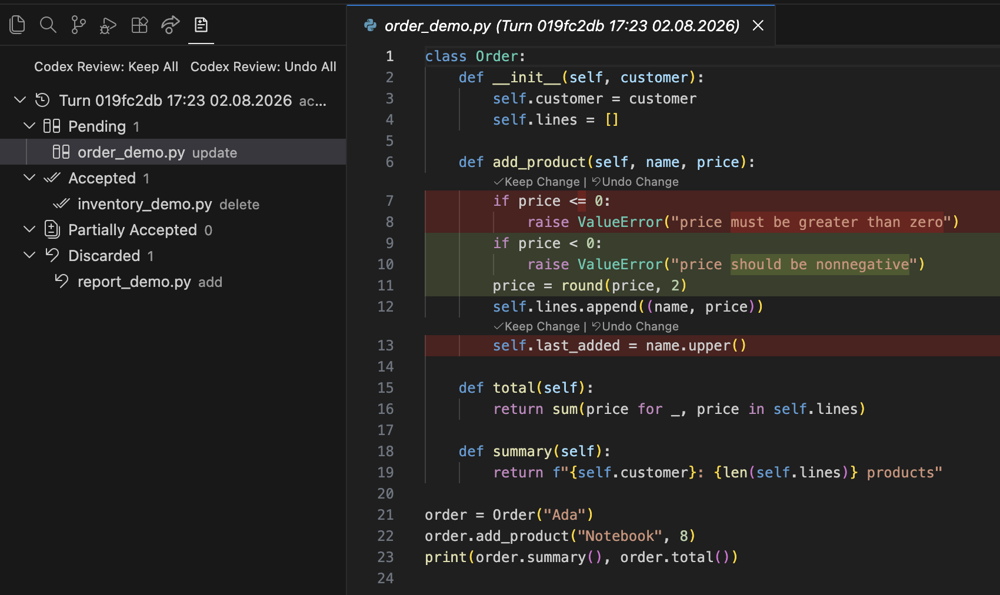
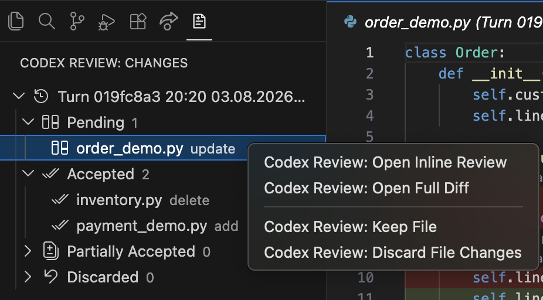
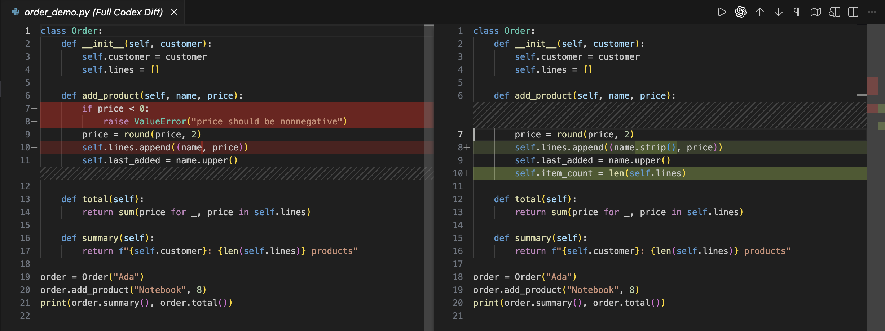
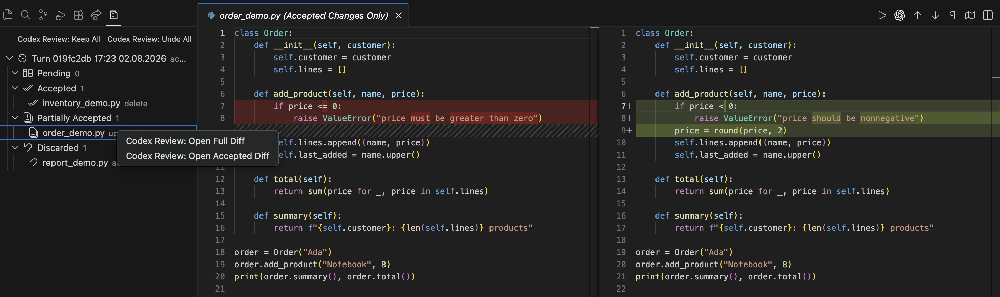

# Codex Inline Review

Codex Inline Review adds a review workflow for file edits made by the existing Codex extension in VS Code or Cursor. Use Codex normally, then inspect and resolve its changes from a dedicated sidebar—no separate chat or prompt flow required.

## Features

- Review Codex edits by turn and file from the **Codex Review** sidebar.
- Accept or discard individual change blocks with **Keep Change** and **Undo Change**.
- Keep or discard every pending change in a file.
- Keep, discard, or redo pending changes for an entire Codex turn.
- Keep or undo all currently pending files at once.
- Open the complete Codex diff or a diff containing only the changes you accepted.
- Browse older turns as read-only archives without changing your current files.
- Refuse unsafe discard operations when a file has changed since Codex edited it.

## Screenshots

**Sidebar and inline block review**



**Pending-file actions**



**Full Codex diff**



**Accepted changes only**



## Installation

1. Download the latest `codex-inline-review-*.vsix` file from [GitHub Releases](https://github.com/ali-kerem/codex-inline-review/releases).
2. In VS Code or Cursor, run **Extensions: Install from VSIX...**.
3. Select the downloaded file and reload the window.

The existing Codex extension should already be installed and used in the same VS Code or Cursor environment.

## Using the review sidebar

1. Ask Codex to make edits as usual. The extension records completed file changes without opening an editor automatically.
2. Open **Codex Review** from the Activity Bar.
3. Expand the active turn and select a file under **Pending**.
4. In the inline review, choose **Keep Change** to accept a block or **Undo Change** to discard it.
5. Right-click a file or the active turn for file-wide and turn-wide actions.

The sidebar groups files into:

- **Pending** — at least one change block still needs a decision.
- **Accepted** — all proposed changes were kept.
- **Partially Accepted** — some changes were kept and others were discarded.
- **Discarded** — all proposed changes were discarded.

While a file still has unresolved blocks, it stays under Pending even if you have already accepted part of it. You can use **Open Accepted Diff** to inspect the accepted portion at any time.

The newest turn is interactive. When a new turn arrives, remaining changes from the previous turn are treated as accepted and that older turn becomes a read-only archive. Full and accepted-only diffs remain available for archived files.

## File and turn actions

Pending files provide:

- **Open Inline Review**
- **Open Full Diff**
- **Open Accepted Diff** when at least one block has been accepted
- **Keep File**
- **Discard File Changes**

The active turn provides actions to keep, discard, or redo its changes. The sidebar title also provides **Keep All** and **Undo All** for all currently pending files.

Discard operations verify that files still match the captured Codex edit before restoring earlier content. If a file changed afterward, the operation is refused instead of overwriting newer work.

## Configuration

| Setting | Default | Description |
| --- | ---: | --- |
| `codexInlineReview.enabled` | `true` | Enables Codex change monitoring. |
| `codexInlineReview.codexHome` | empty | Optional absolute path to the Codex home directory. |
| `codexInlineReview.pollIntervalMs` | `750` | How often the extension checks for completed edits. |
| `codexInlineReview.importRecentSeconds` | `0` | Optionally import edits from a recent time window at startup. |

Use **Codex Review: Import Recent Events** from the Command Palette if you want to import an earlier edit manually.

## Remote SSH

The extension supports Remote SSH workspaces. Codex and this extension must run in the same environment because the extension can observe only the Codex sessions available to its extension host.

If reviews do not appear remotely, run **Codex Review: Show Diagnostics** to see the resolved Codex home and watched session directory.

## Experimental status

This is an experimental integration. It observes the session files written by the existing Codex extension, and that file format may change between Codex versions. The extension does not start another Codex client or require you to send prompts through a separate interface.

## Development

```sh
npm install
npm test
npm run package
```

Additional documentation:

- [Technical notes](docs/technical-notes.md)
- [Manual test plan](docs/manual-testing.md)
- [Changelog](CHANGELOG.md)

## License

[MIT](LICENSE)
